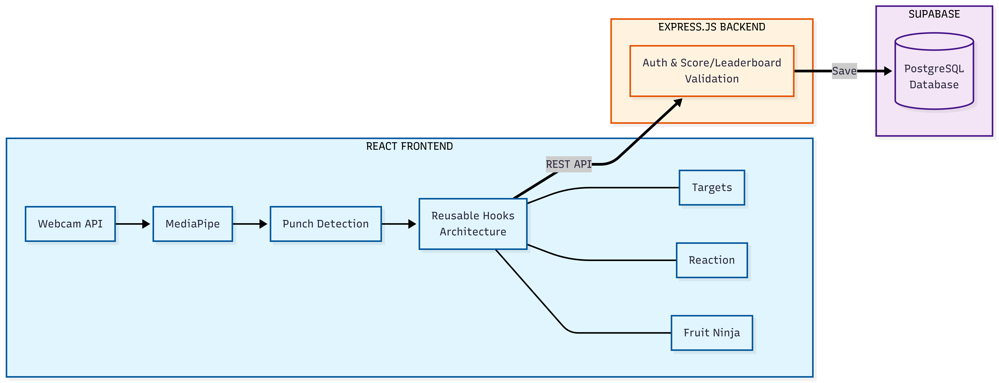

# Punch Perfect

**Real-time computer vision boxing game using only your webcam**

[](https://punchperfect.vercel.app/) [](https://youtu.be/MTk0JX90J_M?si=zEYD1xGc1zptmHhJ)

A production-ready web application that transforms your browser into an interactive boxing training platform. Using MediaPipe's pose estimation and custom punch detection algorithms, the system achieves 30 FPS pose tracking with under 150ms response latency, all processed client-side without external hardware or GPU acceleration.
---
## Game Modes

| Mode | Objective | Key Metric |
|------|-----------|------------|
| **Targets** | Punch left/right color-coded targets before they expire | Targets Hit | 
| **Reaction** | Punch as fast as possible when indicators appear | Reaction time (ms) |
| **Fruit Ninja** | Punch flying fruits while avoiding bombs | Accuracy / Combo |
| **The Range** | Punch targets infinitely for practice | None |

---

## Key Highlights

**Technical Achievement:**
- Processes 33 body landmarks per frame in real-time while maintaining 30 FPS UI rendering
- Custom punch detection algorithm with 80-85% accuracy under optimal conditions
- Built from scratch without game engines using direct Canvas API for performance
- Full-stack architecture with authentication, database design, and API rate limiting

**Engineering Complexity:**
- Solved pose estimation jitter through exponential smoothing filters
- Implemented dual-state tracking to distinguish intentional punches from arm positioning
- Architected modular React hooks system enabling 80% code reuse across three game modes
- Optimized leaderboard queries with PostgreSQL for efficient data aggregation

**Production Deployment:**
- Deployed on Vercel (frontend) and Render (backend) with low-latency CDN response
- Supports concurrent users with IP-based rate limiting
- Supabase PostgreSQL handles authentication, score persistence, and leaderboard aggregation

---

## System Architecture



### Tech Stack

| Layer | Technologies | Purpose |
|-------|-------------|---------|
| **Frontend** | React 19, Vite 7, MediaPipe 0.10 | Real-time pose detection, game rendering |
| **Backend** | Node.js 18, Express 4 | RESTful API, business logic |
| **Database** | Supabase (PostgreSQL) | User auth, score persistence, leaderboards |
| **Deployment** | Vercel (CDN), Render (backend) | Edge deployment, auto-scaling |
| **CV Pipeline** | MediaPipe Pose Landmarker (WASM) | 33-landmark skeleton tracking |

---

## Technical Details

### Punch Detection Algorithm

**Goal:** Distinguish intentional punches from arbitrary hand movements in real-time.

**Approach:**
- Analyzes 3D joint positions (shoulder, elbow, wrist) with multiple geometric validations.
- Detects extended, aligned, straightened, and compact punches.
- Validates joint order and slope consistency to reduce false positives.
- Identifies guard position to differentiate defensive stance from punching.

**Performance:**
- **Accuracy:** 80–85% under optimal conditions  
- **Latency:** 80–150ms  
- Works best with good lighting, fitted clothing, and frontal camera angle.

> *Full implementation is available in `/frontend/mediapipe/detectPunches.js`.*

### Real-Time Pose Processing Pipeline
The processing pipeline:
```
Webcam Frame (640×480) 
    ↓ 33ms @ 30 FPS
MediaPipe Pose Landmarker (WASM)
    ↓ Returns 33 landmarks (x, y, z, visibility)
Exponential Smoothing Filter
    ↓ smoothed = α × new + (1-α) × previous
3D Joint Angle Calculation
    ↓ Vector dot products, arccos
Punch State Machine
    ↓ IDLE → EXTENDED → PUNCHING → COOLDOWN
Game Logic (Collision Detection)
    ↓ Euclidean distance checks
Canvas Rendering (60 FPS)
```

**Performance Optimizations:**
- Exponential smoothing reduces landmark jitter without introducing lag
- RequestAnimationFrame decouples game loop from pose detection for consistent 60 FPS rendering
- Object pooling for targets prevents garbage collection pauses

### React Architecture & State Management

**Custom Hooks:**
- `usePoseDetection()` → Streams landmarks from MediaPipe  
- `usePunchTracking()` → Converts landmarks to punch events  
- `useTargetManager()` → Collision detection & scoring logic  
- `useGameLoop()` → 30 FPS game updates  
- `useWebcam()` → Camera initialization  
- `usePause()` → ESC/blur handling  
- `useSound()` → Audio playback  

**Benefits:**
- Clear separation of concerns (CV, game logic, rendering)
- Hooks are **testable in isolation**
- Supports **mode flexibility**: game modes reuse shared logic
---

---

## Project Structure

```
Punch-Perfect-2/
├── frontend/
│   ├── src/
│   │   ├── components/         # Feature-based UI components
│   │   │   ├── Game/           # Game modes + calibration
│   │   │   │   ├── Targets.jsx         # Target punching mode
│   │   │   │   ├── Reaction.jsx        # Reaction time mode
│   │   │   │   ├── FruitNinja.jsx      # Fruit punching mode
│   │   │   │   ├── Range.jsx           # Practice mode (no scoring)
│   │   │   │   ├── CamCalibration.jsx  # Pre-game setup
│   │   │   │   ├── Score.jsx           # Post-game results
│   │   │   │   ├── Targets.js          # Target class definitions
│   │   │   │   └── FruitDrawings.js    # Canvas rendering utilities
│   │   │   ├── Menu/          # Landing page
│   │   │   ├── GameMenu/      # Mode selection screen
│   │   │   ├── Leaderboard/   # Score display + filtering
│   │   │   ├── Auth/          # Login/signup/password reset
│   │   │   ├── Account/       # User profile management
│   │   │   ├── About/         # Project info page
│   │   │   └── Background/    # Animated background component
│   │   ├── hooks/             # Reusable game logic
│   │   │   ├── usePoseDetection.js    # MediaPipe integration
│   │   │   ├── usePunchTracking.js    # Punch algorithm
│   │   │   ├── useTargetManager.js    # Collision + scoring
│   │   │   ├── useGameLoop.js         # Animation frame loop
│   │   │   ├── useWebcam.js           # Camera initialization
│   │   │   ├── usePause.js            # Pause state handler
│   │   │   └── useSound.js            # Audio playback
│   │   ├── mediapipe/         # Computer vision algorithms
│   │   │   ├── poseLandmarker.js      # MediaPipe setup
│   │   │   ├── detectPunches.js       # Punch detection
│   │   │   ├── landmarks.js           # 3D coordinate helpers
│   │   │   └── calibration.js         # Depth calibration
│   │   ├── api/               # Backend API clients
│   │   │   ├── supabase.js            # Supabase client config
│   │   │   ├── authFunctions.js       # Auth helpers
│   │   │   └── profile.js             # User profile API
│   │   ├── utils/             # Helpers & constants
│   │   │   ├── constants.js           # Game configuration
│   │   │   ├── functions.js           # Utility functions
│   │   │   └── drawingHelpers.js      # Canvas helpers
│   │   ├── context/           # React Context providers
│   │   │   └── GameContext.jsx
│   │   ├── styles/
│   │   │   └── index.css              # Global styles
│   │   ├── assets/
│   │   │   └── sounds/                # Audio files
│   │   │       ├── combo/             # Combo sound effects
│   │   │       ├── fruit-hits/        # Fruit impact sounds
│   │   │       └── target-hits/       # Target hit sounds
│   │   └── main.jsx           # App entry point
│   ├── public/
│   │   └── icons/             # Favicon assets
│   ├── index.html
│   ├── vite.config.js         # Build configuration
│   ├── vercel.json            # Deployment config
│   └── package.json
└── backend/
    ├── controllers/           # Backend logic
    │   ├── scores_controller.js       # Score validation
    │   ├── leaderboard_controller.js  # Leaderboard queries
    │   └── profiles_controller.js     # User profile info
    ├── routes/                # Express route definitions
    │   ├── scores_routes.js
    │   ├── leaderboard_routes.js
    │   └── profiles_routes.js
    ├── middleware/            # Security & rate limiting
    │   └── auth.js                    # JWT verification
    ├── config/                # Configuration
    │   └── supabase.js                # Supabase client
    ├── server.js              # Express server entry
    └── package.json
```

---

## Known Limitations

| Issue | Impact | 
|-------|--------|
| **Lighting Sensitivity** | Accuracy drops to 65-70% in low light conditions | 
| **Clothing Constraints** | Baggy/dark clothing obscures landmarks | 
| **Camera Angle** | Side angles cause tracking loss | 
| **Single Player Only** | No multiplayer support yet | 
| **No Mobile Support** | MediaPipe WASM not optimized for mobile |

---

## Future Roadmap

**Phase 1: Multiplayer**
- WebRTC peer-to-peer 1v1 boxing matches
- Real-time score synchronization
- Matchmaking system with ELO ratings

**Phase 2: ML Enhancement**
- Custom punch classifier with improved accuracy
- Training on labeled punch samples
- Reduce false positives

**Phase 3: Analytics Dashboard**
- Track calories burned, punch power, punch accuracy, improvement over time
- Workout history visualization
- Personalized training recommendations

**Phase 4: Progressive Web App**
- Offline mode with Service Workers
- Installable experience on desktop
- Background sync for score uploads

---

## Project Impact

**Technical Complexity:**
- 10,000+ lines of production code
- 50+ React components and hooks
- 3 distinct game modes with shared architecture
- Full authentication and database integration

**What This Demonstrates:**
- Full-stack development: React, Node.js, PostgreSQL, REST APIs
- Computer vision proficiency: MediaPipe integration, custom algorithms
- Performance optimization: 30 FPS real-time processing with low latency
- System design: Modular architecture, scalable database queries
- Production deployment: Edge CDN, backend hosting, authentication services
- User experience focus: Calibration flows, error handling, responsive feedback

---

## Authors

**Aaron Xu**  
Software Engineer  

**Brian Yin**  
Software Engineer  

**Project Timeline:** 26 months (Nov 2023 - Present)

---

## Acknowledgments

- Punch Perfect V1 (Original Python/OpenCV prototype served as proof-of-concept)
- MediaPipe Team (Google) for open-source pose estimation models
- Supabase for backend infrastructure and authentication
- Vercel & Render for hosting and deployment platforms
